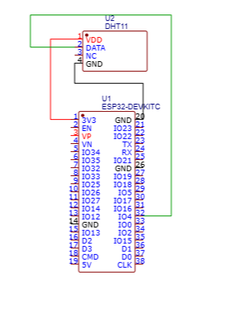
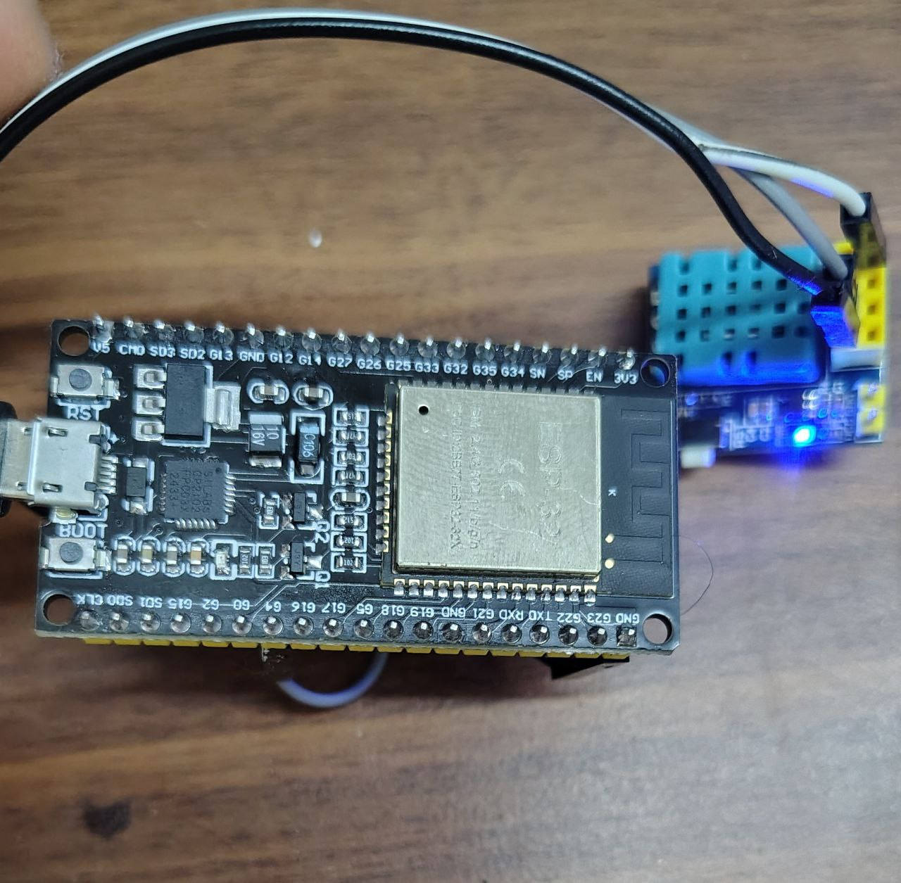
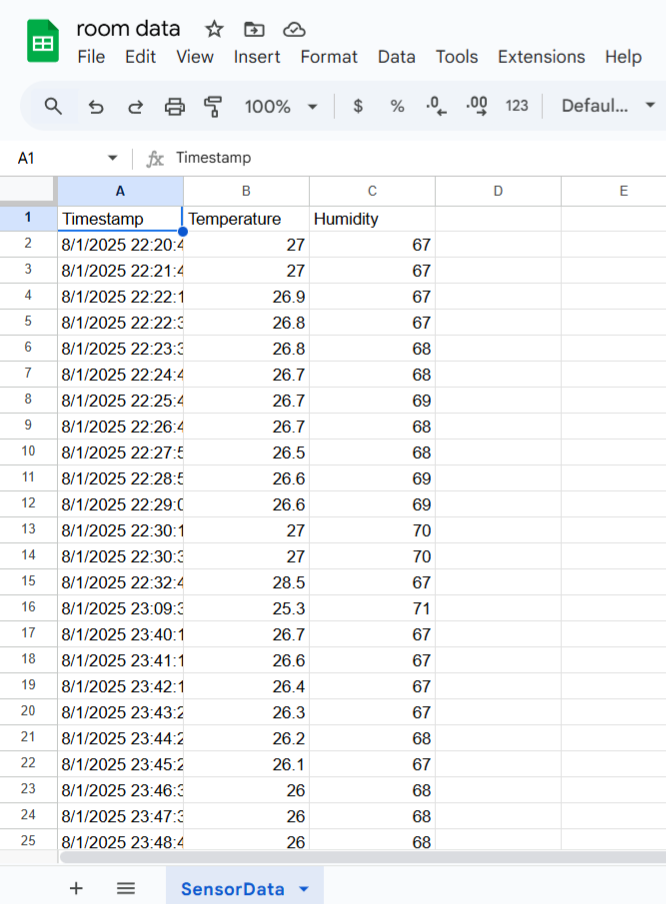
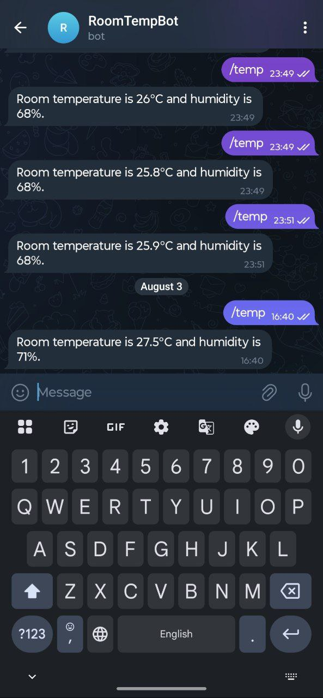

# RoomTempBot: Temperature & Humidity Tracker with ESP32 + Google Sheets + Telegram Bot

This project allows you to monitor room temperature and humidity using an ESP32 and DHT11 sensor. The data is logged to Google Sheets via Google Apps Script and retrieved through a Telegram Bot using a `/temp` command.

##  Overview of Components

- **ESP32**: Reads temperature and humidity using a DHT11 sensor
- **Google Sheets**: Logs the data and stores it with timestamps
- **Google Apps Script**: Acts as an API to log data and return values
- **Telegram Bot**: Lets you ask for the latest temperature and humidity using `/temp`

##  Prerequisites

- ESP32 board
- DHT11 sensor
- Arduino IDE or Arduino Cloud account
- Google account with access to Google Sheets & Apps Script
- Telegram account

##  1. ESP32 Setup (Arduino Cloud or IDE)

###  Folder: `esp32Code/`

1. Connect your DHT11 sensor to ESP32 (e.g., data pin to GPIO4).
2. Use Arduino IDE or Arduino Cloud.
3. Upload the `main.ino` code which:
   - Reads temperature & humidity
   - Sends it via HTTP to the Apps Script URL

Make sure you update:
- Your Wi-Fi credentials
- Google Apps Script URL

### Circuit digram

### hardware

## 2. Google Sheets + Apps Script

###  Folder: `GoogleAppsScript/`

#### Script Features:
- Appends temperature and humidity sent from ESP32
- Responds with latest values when Telegram bot calls it

#### Steps:
1. Open [https://script.google.com](https://script.google.com)
2. Paste `Code.gs` from this folder
3. Link it to a Google Sheet with a tab named `SensorData`
4. Deploy as Web App:
   - Execute as: **Me**
   - Who has access: **Anyone**
5. Copy the Web App URL for use in ESP32 and Telegram webhook

 Full details: See `GoogleAppsScript/README.md`

### Live Sensor Data in Google Sheets

## 3. Telegram Bot Integration

###  Folder: `telegrambot/`

####  What It Does:
- Receives `/temp` command
- Calls your Apps Script to get latest readings
- Replies to the user with temperature & humidity

####  Steps:
1. Create a bot using [@BotFather](https://t.me/BotFather)
2. Copy the token
3. Paste it in `Code.gs` where indicated
4. Set webhook using this URL:

https://api.telegram.org/bot<YOUR_BOT_TOKEN>/setWebhook?url=<YOUR_WEB_APP_URL>

5. Start chatting with your bot and type `/temp`

 Full setup guide: See `telegrambot/TelegramBot_README.md`

## Example Output

User: /temp
Bot: Room temperature is 28.5°C and humidity is 67%.

### Telegram Bot in Action

## Potential Extensions

- Add soil moisture or gas sensors for agriculture
- Extend Telegram bot with more commands
- Send alerts when values cross thresholds
